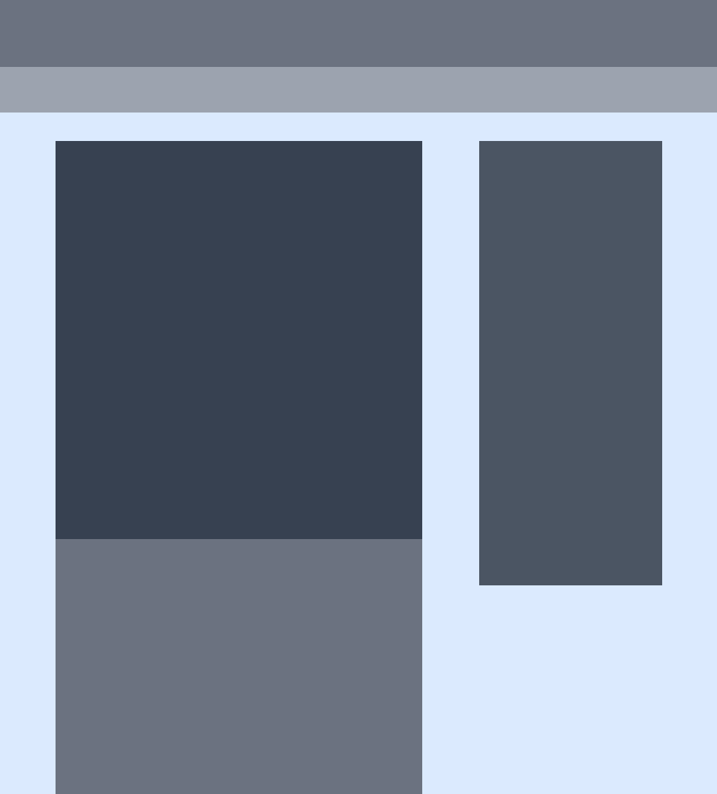

# Readme
# Design Tear-Down: Visual Heiarchy

## Overview

### Challenge

The goal of this exercise was to start training myself to think in terms of visual hierarchy, typography and design principles.

My job was to create a grayscale heat map of the [Smashing Magazine website](http://smashingmagazine.com/) that indicates which elements have the greatest weight in the visual hierarchy.

See the complete design requirements in The Odin Project curriculum [here](https://web.archive.org/web/20211128175755/https://www.theodinproject.com/paths/full-stack-javascript/courses/html-and-css/lessons/design-teardown).

Being such an "artsy" project, I took advantage of "artistic liberty" and decided to implement this project using Tailwind CSS.

### Screenshot

  

### Links

- [Live site](https://mattdimicelli.github.io/Tailwind_Visual_Heiarchy/)
- [Repo](https://github.com/mattdimicelli/Tailwind_Visual_Heiarchy/)

## My process

### Built with

- Tailwind CSS
  - I used the experimental 'just-in-time' option, which although I know might not be ideal for a production application, was necessary in my case because my current computer is quite old, and the JIT enables **much** quicker compilation during development.
  - I used a few custom theme properties
- Vanilla JS
- Custom webpack config
- npm scripts which use environmental variables

### What I learned

I stepped into this project with the intention of expanding my horizons a bit,
since I had just read a primer on design principles, typography, visual heiarchy,
and more related topics, even industrial design.  I didn't know anything about these
topics previously because I guess that you can say that I was never an "artsy" person.  
But I love to learn and put myself to it.  I truly enjoyed the mental exercise of 
looking for the "heat" and actually mapping it out.  Doing this exercise made 
me realize just how much thought should be put into these questions.  A webpage 
is, after all, a presentation.  I also enjoyed playing with Tailwind CSS.  
